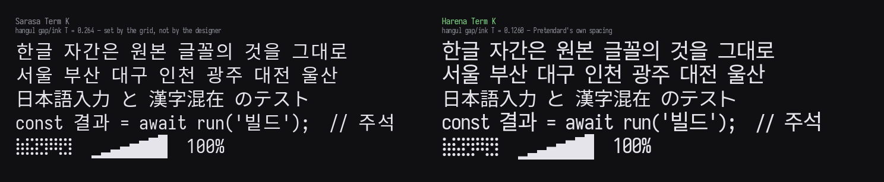

# Harena Term

韓国語・日本語・英語のいずれも一級市民として扱う、ターミナル用等幅フォント。
セル格子は厳密に 1:2。

[English](README.md) | **日本語** | [한국어](README.ko.md)



多くの CJK ターミナルフォントは、全角字を一セルに収めたうえで字間は成り行きに
任せます。ハングルではその結果が、原作者の描いた字間よりはるかに緩みます —
Sarasa Term K の字間/字画比は `T = 0.264`、プロポーショナルの Pretendard は
`0.1287` で、二倍以上詰まっています。

Harena Term は各文字体系を、**その固有アドバンスがセルにちょうど収まるよう**
拡大します。`T` は倍率に対して不変なので、これは近似ではなく原本の字間の
**恒等再現**です。出荷バイナリ実測でハングル `T = 0.1260`、**Sarasa 比 52%
詰まった**状態で、格子は依然として厳密に 1:2 です。

[Iosevka Term Nerd Font Mono](https://github.com/be5invis/Iosevka)（ラテン、
記号、罫線素片、点字、Powerline、Nerd Font アイコン）と
[Pretendard JP](https://github.com/orioncactus/pretendard)（ハングル、漢字、
仮名）を統合し、両者が全角で描かない部分を
[M PLUS 1p](https://github.com/coz-m/MPLUS_FONTS) と
[Noto Sans KR](https://github.com/notofonts/noto-cjk) が埋めています。

## ダウンロード

最新版は [**Releases**](../../releases/latest) から。

> **1.0.0。** 安定版の番号に課していた三つの条件がすべて満たされました。実際の
> リリースで検証されたリリースワークフロー、0.9.0 が抱えていた字画の太さの欠陥の
> [修正](docs/adr/0014-the-compensation-target-erases-the-source-relative-weighting.md)、
> そして仮定ではなく[実行して測定した](docs/adr/0017-windows-verified.md) Windows。
> この番号が意味し**ない**のは、もう何も残っていないということです —
> [既知の制限](CHANGELOG.md#known)は一覧にしてあり、そのどれもが見落としではなく
> 記録を伴う決定です。[1.0 までの道のり](CHANGELOG.md#the-road-to-10)。

| アーカイブ | 用途 |
|---|---|
| `HarenaTerm-ttf.zip` | デスクトップ — ターミナル、エディタ、ワープロ |
| `HarenaTerm-woff2.zip` | ウェブ — `@font-face` でブラウザ上のターミナルへ |

四つの WOFF2 は `@harena-hq/term-font` npm パッケージとしても配布できる構成に
なっています。その名前を登録して公開を有効にするまでは、Releases が正式な
ダウンロード元です。メンテナ向けの手順は
[`docs/npm-publishing.md`](docs/npm-publishing.md) に記録されています。

各アーカイブに四つの書体が入っています: `Harena Term K` と `Harena Term J` の
Regular と Bold。

## インストール

展開して OS のフォントインストーラを使ってください — macOS は Font Book、
Windows はファイルを選んで右クリック → インストール。あるいはシステムが探す
場所に置くだけでも構いません:

```sh
# macOS
cp *.ttf ~/Library/Fonts/

# Linux
cp *.ttf ~/.local/share/fonts/ && fc-cache -f
```

このプロジェクトはインストールスクリプトを配布しません。OS がすでに十分に
こなしている作業であり、その先はこちらが保守しても全プラットフォームで試験
できないスクリプトより、パッケージマネージャのほうが優れているからです —
[ADR 0016](docs/adr/0016-no-install-scripts.md)。

## 二つの書体: K と J

韓国と日本は同じ漢字を違う形で描きます。最も分かりやすいのが 運 進 週 選 過 達
通 連 遠 の左下にあるしんにょうで、日本の新字体は点一つ、韓国は伝統的な点二つを
使います。

Unicode はこれらを**同一のコードポイント**として符号化します。つまり違いは
符号化ではなく字形選択であり、通常は言語タグで発動する OpenType の `locl`
機能に収められます。**ターミナルはその機能に手が届きません** — テクスチャ
アトラス方式のレンダラは素の CSS 文字列でフォントを指定するため
`font-feature-settings` も言語タグもなく、ネイティブのターミナルも実行単位で
言語をタグ付けすることはほとんどありません。

そのため地域字形を `cmap` に焼き込み、二つの書体を配布しています。

| 書体 | どちらを選ぶか |
|---|---|
| **Harena Term J** | 日本の字形。日本語を読むならこちら。 |
| **Harena Term K** | 韓国の字形。韓国語中心なら、または迷うならこちら。 |

両者は **37652 のうち 611 コードポイント**だけが異なり、すべて漢字の範囲内で、
**アドバンスの差はゼロ**です。ですから一つの画面に混在させても行がずれません。
ハングル、仮名、ラテン、記号、罫線素片、点字は両者でバイト単位で同一です。

## 収録範囲

**86 の Unicode ブロックにわたる 37652 コードポイント**、一書体あたり 38478
グリフ。ブロックごとの出典は [`docs/COVERAGE.md`](docs/COVERAGE.md) に全て
あります。

| 何を | どれだけ |
|---|---|
| 漢字 | **7138 字** — JIS X 0208、cp932、KS X 1001 を完備 |
| 仮名 | ひらがな 90、カタカナ 94、半角カタカナ 63 |
| ハングル音節 | **11172 字を完備**、加えて組み合わせ用字母 67 |
| 点字 | **256/256** — エージェント TUI がスピナーをこれで描きます |
| 罫線素片 / ブロック / 幾何学模様 / 矢印 | 128 · 32 · 96 · 112 |
| Nerd Font アイコン | Powerline、Font Awesome、Devicons、Octicons、Material ほか |
| コードページ | cp932 **100%**、cp949 **99.98%** |

このフォントは **NFD ハングルを自力で合成**します — 11172 個の `ccmp`
合字によって。macOS はファイル名を NFD で保存するため、`ls` の一覧に並ぶ韓国語
ファイル名はすべて組み合わせ用字母として届きます。これをシェイパー任せにする
フォントは、CoreText 上で字母が重なって描かれます。

### 読んでおくべき互換性の注意点

字幅は xterm.js の `unicode11` プロバイダが実装する Unicode 11 East Asian Width
表に従います。この表は **Ambiguous 幅の文字を一セル**として解釈します —
`♥ ○ → ± ′` ほか 1197 字。

ターミナルを `ambiguous = wide` に設定すると、それらの文字に**二セル**が予約され
ますが、このフォントは一セルで描くため該当行がずれます。Sarasa は逆の選択を
しています。フォントはグリフごとに幅を一つしか持てず、両方を満たすことは
できません。ターミナルが `ambiguous = wide` なら、このフォントは合いません。

## 自分でビルドする

ビルドは**固定されたソースからバイト単位で再現可能**で、成果物八点のハッシュが
`SHA256SUMS` に記録されています。

```sh
pip install -r requirements.txt
pnpm install
scripts/fetch_sources.sh      # 固定 URL、SHA-256 検証、ラテンのビルドまで
python3 scripts/build.py      # ラテンと CJK を格子上で統合
python3 scripts/postbuild.py  # ヒンティング、再スタンプ、WOFF2、SHA256SUMS
python3 scripts/verify.py     # ゲート
cd dist && sha256sum -c ../SHA256SUMS
```

`verify.py` は**報告せず、断言します** — 終了コードがそのままゲートです。四書体
にわたって **166 の検査**を走らせます: すべてのアドバンスをバイナリから導出し直
して幅プロバイダの表と照合（収録済み 21349 コードポイント全て）、全角グリフの
セルはみ出し検査、NFD 音節 11172 個を `ccmp` 合字ツリーで直接走査、字間とハン
グル/漢字の字画比を Pretendard 原本と照合、`OS/2` の文字体系宣言、ハングル音節
全てを 13–18 ppem でラスタライズし、ヒンティングが設計上の横画を消さないこと
の証明、そして出荷バイトに刻まれた再現性スタンプまで。

`SOURCE_DATE_EPOCH` でビルドスタンプを上書きできます。CI が毎プッシュで全工程を
実行し、ハッシュを検査します。

各選択の理由は — それを決定づけた実測値と、それを再び開くための条件とともに —
[`PLAN.md`](PLAN.md) と [`docs/adr/`](docs/adr/) にあります。

## 出典

このフォントは統合物です。描かれたものはすべて他の誰かが描いたものであり、
ここで新たに作ったのは、寸法合わせと格子とゲートです。
[`docs/LINEAGE.md`](docs/LINEAGE.md) が各ソースの辿ってきた手を追跡しています。

| | 描いた人 | ここで描いているもの |
|---|---|---|
| [Iosevka](https://github.com/be5invis/Iosevka) | Belleve Invis | ラテン、記号、罫線素片、点字 |
| [Nerd Fonts](https://github.com/ryanoasis/nerd-fonts) | Ryan L McIntyre ほか貢献者 | アイコンセット |
| [Pretendard JP](https://github.com/orioncactus/pretendard) | 길형진 (Kil Hyung-jin) | ハングル、漢字、仮名 |
| [M PLUS 1p](https://github.com/coz-m/MPLUS_FONTS) | 森下浩司 | 括弧類、半角カタカナ、〇 〒 〓 |
| [Noto Sans KR](https://github.com/notofonts/noto-cjk) | Adobe / Google | 囲み文字・組文字、古ハングル字母 |

Pretendard の name テーブルは、ラテンを Inter、ハングルと漢字を Noto Sans CJK
(Source Han Sans)、仮名を M PLUS 1p に帰しています。そのため幾つかは系譜に二度
現れます — 一度は直接、もう一度は Pretendard を経由して。

## ライセンス

JetBrains Mono と Nerd Fonts に倣い、**何であるか**によって分けています。

| | 対象 |
|---|---|
| [`OFL.txt`](OFL.txt) — SIL Open Font License 1.1 | **フォント本体。** 配布成果物と、このツリーからビルドされたすべて |
| [`LICENSE`](LICENSE) — Apache License 2.0 | **ビルドシステム。** スクリプト、ビルドプラン、ドキュメント |
| [`THIRD_PARTY_NOTICES.md`](THIRD_PARTY_NOTICES.md) + [`licenses/`](licenses/) | どちらでもない Nerd Fonts のアイコンセット。一部は MIT や CC-BY-4.0 で、二つは著作者表示が必要です |

**`Harena Term` は OFL の予約フォント名 (Reserved Font Name) です。** フォントを
自由に改変・再配布できますが、改変版は別の名前を使う必要があります。

Copyright © 2026 Jeeyong Um. 上流ソースの著作権表示は OFL §2 の要求どおり
`OFL.txt` に保持されています。
